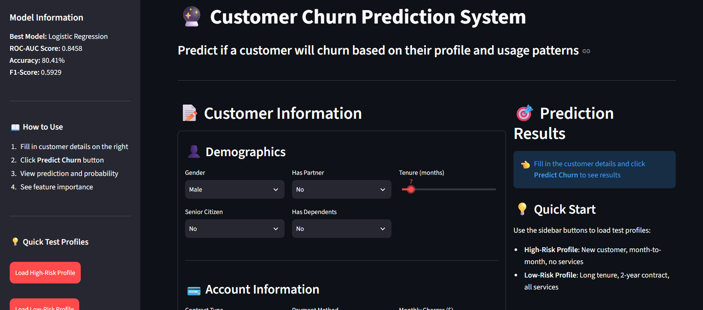
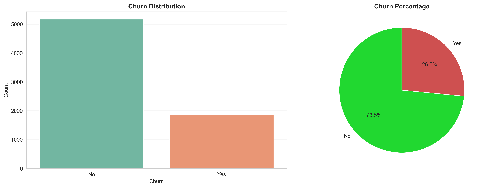
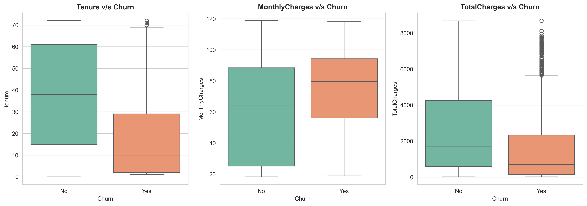
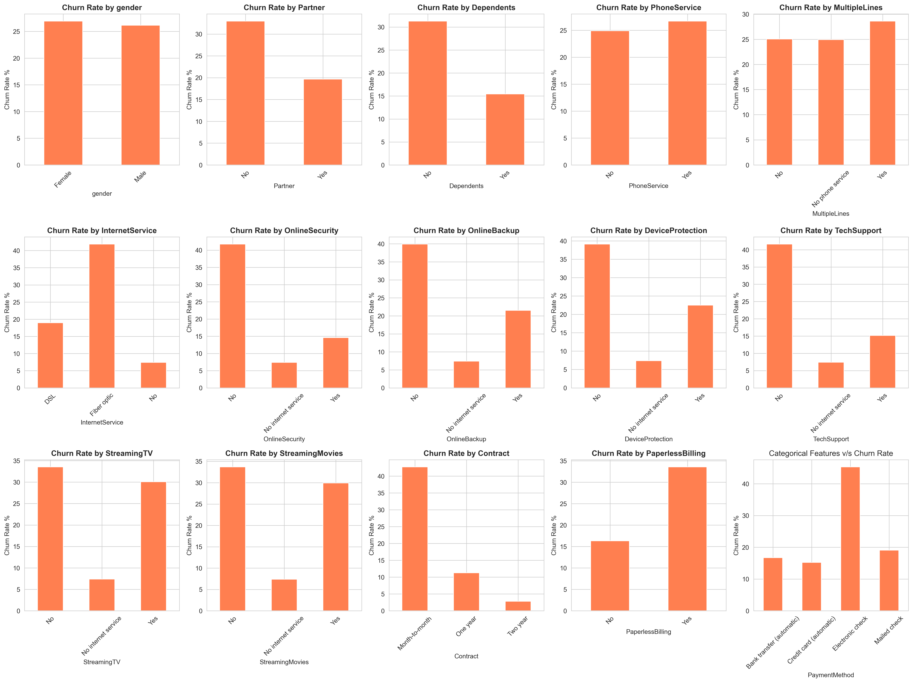
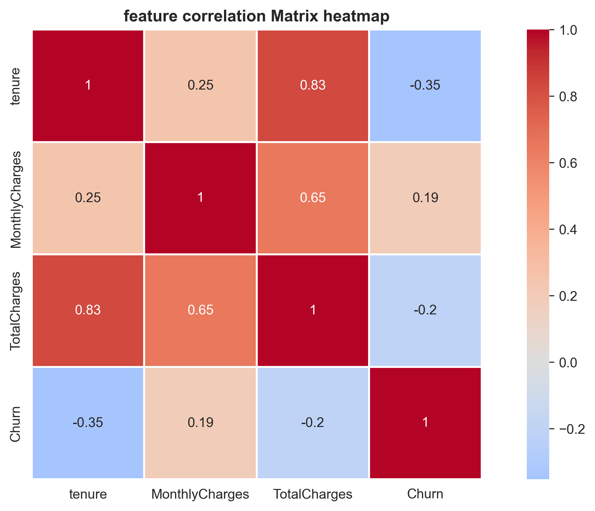
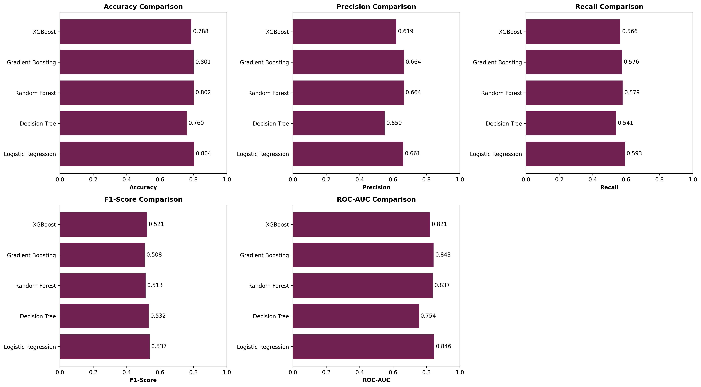
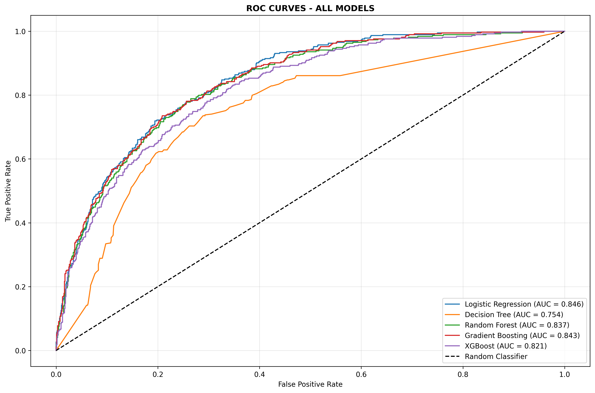
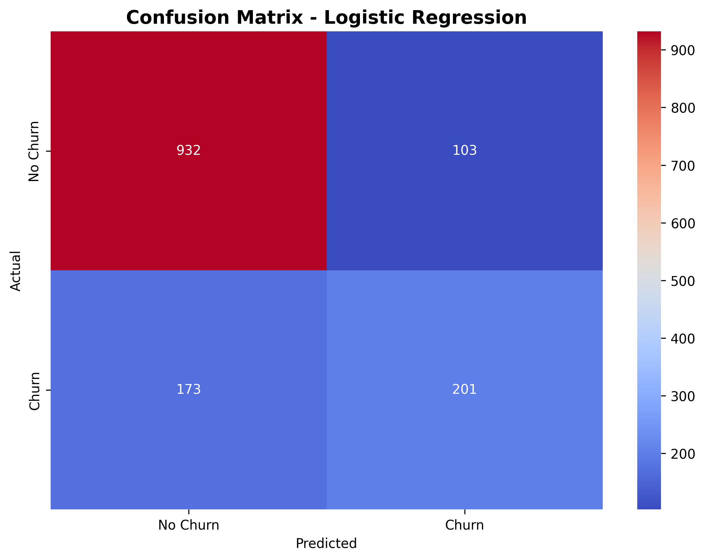

# 📊 Telecom Customer Churn Prediction

An end-to-end machine learning project for predicting customer churn in the telecommunications industry using Python and scikit-learn. The project covers data preprocessing, feature engineering, exploratory data analysis, model training, evaluation, and an interactive Streamlit prediction application.


## 🚀 Interactive Dashboard



The interactive Streamlit application allows users to enter customer information and receive a real-time churn prediction.

**Live Demo:** [Telecom Customer Churn Prediction App](https://telecom-customer-churn-prediction-ml.streamlit.app/)

## 🎯 Project Overview

Customer churn is a major challenge for telecommunications companies because losing existing customers can negatively impact recurring revenue.

This project analyzes customer demographics, account information, subscribed services, tenure, and billing information to identify patterns associated with churn and build a machine learning classification model.

### Project Workflow

**Data → Preprocessing → Feature Engineering → EDA → Model Training → Evaluation → Prediction App**

## 📌 Key Results

Five machine learning classification models were trained and compared.

| Model                   |   Accuracy |  Precision |     Recall |   F1-Score |    ROC-AUC |
| ----------------------- | ---------: | ---------: | ---------: | ---------: | ---------: |
| **Logistic Regression** | **80.41%** | **66.12%** | **53.74%** | **59.29%** | **84.58%** |
| Gradient Boosting       |     80.13% |     66.43% |     50.80% |     57.58% |     84.27% |
| Random Forest           |     80.20% |     66.44% |     51.34% |     57.92% |     83.72% |
| XGBoost                 |     78.78% |     61.90% |     52.14% |     56.60% |     82.08% |
| Decision Tree           |     76.01% |     54.97% |     53.21% |     54.08% |     75.42% |

### Best Model — Logistic Regression

* **ROC-AUC:** 0.8458
* **Accuracy:** 80.41%
* **Precision:** 66.12%
* **Recall:** 53.74%
* **F1-Score:** 59.29%

ROC-AUC was given particular importance because the churn target is imbalanced.

## 📂 Dataset

The project uses the **Telco Customer Churn Dataset**.

* **Records:** 7,043 customers
* **Target:** Churn
* **Classes:** Yes / No
* **Features:** Demographic, account, service, and billing information

### Feature Categories

**Demographics**

* Gender
* Senior Citizen
* Partner
* Dependents

**Account Information**

* Tenure
* Contract
* Payment Method
* Paperless Billing

**Services**

* Phone Service
* Internet Service
* Online Security
* Online Backup
* Device Protection
* Tech Support
* Streaming Services

**Billing**

* Monthly Charges
* Total Charges

## 🛠️ Tech Stack

* **Python**
* **Pandas**
* **NumPy**
* **Scikit-learn**
* **Matplotlib**
* **Seaborn**
* **XGBoost**
* **Joblib**
* **Jupyter Notebook**
* **Streamlit**

## 🔄 Data Preprocessing & Feature Engineering

The dataset was prepared for machine learning through several preprocessing steps:

* Handled missing values in `TotalCharges`
* Converted numerical fields into appropriate data types
* Removed unnecessary customer identifiers
* Encoded categorical variables
* Scaled numerical features using `StandardScaler`

Additional features were engineered to capture customer behavior:

* `tenure_group`
* `avg_monthly_per_tenure`
* `num_services`

## 🔍 Exploratory Data Analysis

EDA was performed to understand customer characteristics and investigate patterns associated with churn.

### Churn Distribution



### Numerical Feature Analysis



### Categorical Feature Analysis



### Correlation Analysis



## 🤖 Machine Learning

The following classification algorithms were trained and evaluated:

1. Logistic Regression
2. Decision Tree
3. Random Forest
4. Gradient Boosting
5. XGBoost

### Evaluation Metrics

* Accuracy
* Precision
* Recall
* F1-Score
* ROC-AUC

### Model Comparison



### ROC Curves



### Confusion Matrix



Logistic Regression achieved the highest ROC-AUC score among the evaluated models and was selected as the final model.

## 🌐 Streamlit Application

The project includes an interactive Streamlit application built using the trained model and preprocessing pipeline.

Users can enter customer attributes through the application and receive a predicted churn outcome.

The application loads:

* `best_model_logistic_regression.pkl`
* `preprocessor.pkl`

The model is therefore ready to be deployed as an interactive web application.

## 💻 Running the Project Locally

### Prerequisites

* Python 3.8+
* pip

### 1. Clone the repository

```bash
git clone https://github.com/sahilkhyalia51/telecom_customer_churn_prediction.git
```

### 2. Create a virtual environment

**Windows:**

```bash
python -m venv venv
venv\Scripts\activate
```

**macOS/Linux:**

```bash
python3 -m venv venv
source venv/bin/activate
```

### 3. Install dependencies

```bash
pip install -r requirements.txt
```

### 4. Run the Streamlit application

```bash
streamlit run app.py
```

The application will open in your browser.

## 📁 Project Structure

```text
telecom_customer_churn_prediction/
│
├── app.py
├── data/
│   └── telco_comm_churn.csv
│
├── models/
│   ├── best_model_logistic_regression.pkl
│   └── preprocessor.pkl
│
├── notebooks/
│   ├── 01_eda.ipynb
│   ├── 02_data_preprocesing.ipynb
│   └── 03model_training.ipynb
│
├── reports/
│   ├── categorical_analysis.png
│   ├── churn_distribution.png
│   ├── confusion_matrix.png
│   ├── correlation_heatmap.png
│   ├── model_comparison.csv
│   ├── model_comparison_graph.png
│   ├── numerical_analysis.png
│   ├── roc_curves.png
│   └── dashboard.png
│
├── src/
│   └── data_preprocessing.py
│
├── requirements.txt
├── runtime.txt
└── README.md
```

## 🔮 Future Improvements

* Improve recall through class-imbalance handling and threshold optimization
* Experiment with additional feature engineering techniques
* Add explainable AI using SHAP
* Improve the Streamlit interface with customer-risk explanations
* Add model monitoring and automated retraining

## 📚 Skills Demonstrated

* Data Cleaning & Preprocessing
* Exploratory Data Analysis
* Feature Engineering
* Python
* SQL-ready data workflows
* Machine Learning
* Classification
* Model Evaluation
* Data Visualization
* Model Deployment
* Streamlit

## 👤 Author

**Sahil Singh**

GitHub: [@sahilkhyalia51](https://github.com/sahilkhyalia51)
